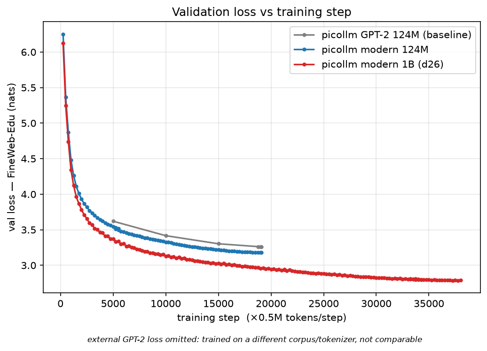
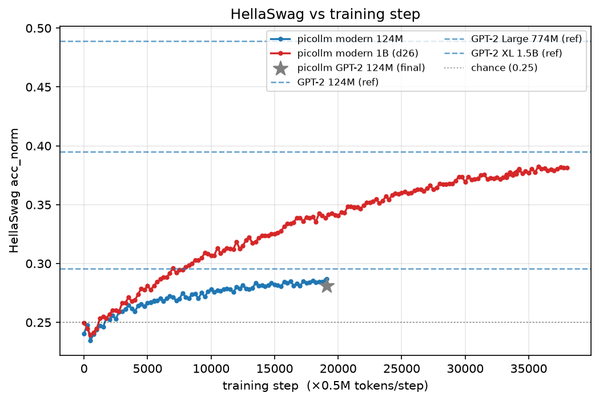

# picollm

Have fun training LLM!

Training a 1B model from scratch: start by reproducing **GPT-2 (124M)**, modernize the architecture, then scale to ~1B and pretrain Chinchilla-optimally on 20B tokens of FineWeb-Edu (38000 steps ≈ 20 tokens/param). Then SFT into a chat model and RL on GSM8K.

## Layout

| File | Purpose |
|------|---------|
| `model.py` | `GPT` + `GPTConfig` — modern dense stack: RoPE, RMSNorm, QK-norm, ReLU² MLP, no biases, untied embeddings, logit softcap; size set by `--depth` |
| `dataloader.py` | `DataLoaderLite` — streams pre-tokenized `.npy` shards |
| `base_train.py` | `TrainConfig` + `BaseTrainer` (DDP, grad accum, width-scaled cosine LR, val, sampling, HellaSwag, checkpoint + `--resume`) |
| `finewebedu_curator.py` | Streams + tokenizes FineWeb-Edu into `.npy` shards (`sample-100BT` → ~20B tokens under `edu_fineweb20B/`) |
| `hellaswag.py` | HellaSwag rendering + scoring (`get_most_likely_row`) |
| `tokenizer.py` | `ChatTokenizer` — gpt2 tiktoken + chat special tokens; `render_conversation` / `render_for_completion` |
| `sft_data.py` | `SFTDataLoader` + `MixtureDataset` (SmolTalk + optional GSM8K blend) |
| `chat_sft.py` | `SFTTrainer` — full-weight SFT (overfit gate, `--mix-gsm8k`, `--resume`) |
| `chat_cli.py` | load a checkpoint + `generate_reply`; interactive chat REPL |
| `tasks/gsm8k.py` | GSM8K task (`reward`/`evaluate`) + pass@k signal gate (`--gate`) |
| `rl_train.py` | GRPO RL on GSM8K (batched rollouts, DDP, pass@k eval, checkpoint) |
| `plot_results.py` | loss + HellaSwag comparison plots (`plots/`) |
| `run_d26.sh` | auto-resume wrapper for the long 1B run (rides out NCCL flakes) |

## Usage

The full pipeline, from data to an RL'd chat model:

```bash
# 1. Data — stream + tokenize ~20B tokens of FineWeb-Edu -> edu_fineweb20B/
python finewebedu_curator.py

# 2. Pretrain the ~1B model (d26) on 4 GPUs, 20B tokens (Chinchilla-optimal)
torchrun --standalone --nproc_per_node=4 base_train.py \
    --depth 26 --device-batch-size 16 --data-dir edu_fineweb20B \
    --max-steps 38000 --ckpt-every 3000 --log-dir log_d26
bash run_d26.sh          # ...or this flake-resilient auto-resume wrapper
# (124M baseline: drop --depth, use --data-dir edu_fineweb10B --max-steps 19073)

# 3. SFT into a chat model (blend GSM8K for math + answer format)
python chat_sft.py --base-checkpoint log_d26/model_step_37999.pt \
    --device-batch-size 16 --mix-gsm8k --log-dir log_sft_d26

# 4. Chat with it / evaluate
python chat_cli.py --ckpt log_sft_d26/model_step_1999.pt
python -m tasks.gsm8k --gate --ckpt log_sft_d26/model_step_1999.pt --n 100 --k 8

# 5. RL (GRPO) on GSM8K
torchrun --standalone --nproc_per_node=4 rl_train.py --mode train \
    --ckpt log_sft_d26/model_step_1999.pt --log-dir log_rl

# comparison plots -> plots/
python plot_results.py
```

`base_train.py` uses `total_batch_size=524288` (~0.5M tokens/step), so the token
budget = `max_steps × 0.5M`. `--depth D` sets the model size (`n_layer=D`,
`n_embd=D×64`, `n_head=n_embd/128`); LR auto-scales `∝ 1/√(d_model/768)`. Lower
`--device-batch-size` for bigger models to fit memory (grad-accum compensates).

## Architecture renovation — modern vs GPT-2 (124M)

First, a controlled A/B at 124M: two architectures trained from scratch under
identical config, data, and budget (19073 steps, 10B tokens of FineWeb-Edu,
~0.5M tokens/step) — the original **GPT-2 (2019)** recipe, and a **modern dense**
stack (RoPE, RMSNorm, QK-norm, ReLU² MLP, no biases, untied embeddings, logit softcap).

| Metric | GPT-2 baseline | modern-dense | reference (GPT-2 / build-nanogpt) |
|--------|----------------|--------------|------------------------------------|
| Final val loss (FineWeb-Edu) | 3.257 | **3.180** | ~3.28 |
| HellaSwag acc_norm | 0.281 | **0.287** | 0.2955 / ~0.305 |

The baseline is healthy: init loss 10.955 (≈ ln(50304)), final val on par with the
reference. The **modern architecture is ~0.08 nats lower across the whole curve**
(~7% lower perplexity) — a clean, consistent win. HellaSwag barely moves (+0.006):
it's an emergent benchmark that stays near chance at 124M scale regardless of loss.
Caveat: untying the embeddings adds ~39M params (~163M vs 124M total), so part of
the gain is extra capacity, not pure architectural efficiency.

## SFT — chat model

Supervised fine-tuning on [SmolTalk](https://huggingface.co/datasets/HuggingFaceTB/smol-smoltalk) (see Usage step 3) turns the autocompleter into a chat model. Conversations are rendered with role special tokens (reusing the free padded vocab slots 50257–50260) and loss is masked to assistant tokens only (`ignore_index=-1`). An `--overfit` mode memorizes a single batch (loss → ~0) as a pipeline sanity check.

Result on the 124M base (2000 steps, LR 3e-5): train/val loss plateau at **~1.73**. The plateau is expected — SFT loss floors at the entropy of free-form assistant text; it can't reach 0 like the single-batch overfit. The model replies coherently in chat format and stops on `<|assistant_end|>` (it hallucinates freely — a 124M-scale limit, not an SFT bug).

## RL (GRPO) and why we move to a 1B model

We implemented GRPO-style RL on GSM8K (group-relative advantages, on-policy, no critic/KL) to push math reasoning. It ran correctly end-to-end — but **on the 124M base it didn't move the needle**, and that turned out to be a *scale* problem, not a pipeline problem:

- **SmolTalk-only SFT:** GSM8K pass@8 ≈ **6%**.
- **SFT with GSM8K blended in (×4 epochs):** pass@8 ≈ **5%** — the model learned the `#### <answer>` format but not how to *solve* the problems.
- **RL on top:** eval pass@1 stayed flat (~0.01) over 1000s of steps.

RL only *amplifies* ability the base already has, and at 124M there's almost none to amplify (pass@1 ≈ 0.5–1%). SFT and RL teach **format and consistency**, not raw reasoning — that capability is set in **pretraining**, and it's an emergent property of scale. The same reason HellaSwag stayed near chance is why GSM8K stays near zero: a 124M model is simply below the capability threshold for these tasks.

**So the bottleneck is model size, not the recipe** — which motivates scaling the (now-modernized) architecture to **~1B (`--depth 26`)**, trained Chinchilla-optimally on 20B tokens, where reasoning benchmarks begin to emerge.

## Scaling to 1B (d26) — results

Scaled the modern architecture to **~1.03B params** (`--depth 26`: 26 layers, 1664-wide, 13 heads) and pretrained on **20B tokens** of FineWeb-Edu (20 tok/param, Chinchilla-optimal). LR is auto-scaled by width (`∝ 1/√(d_model/768)`).

| Metric | GPT-2 124M (baseline) | modern 124M | **modern 1B (d26)** |
|--------|-----------------------|-------------|---------------------|
| Final val loss (FineWeb-Edu) | 3.257 | 3.180 | **2.79** |
| HellaSwag acc_norm | 0.281 | 0.287 | **0.381** |





The HellaSwag plot is the punchline: **at 124M, HellaSwag is stuck near chance** (flat ~0.28, just under GPT-2 124M's 0.2955) no matter how long you train. **Scaling to 1B unlocks it** — HellaSwag climbs steadily to **0.381**, clearing GPT-2 124M and reaching GPT-2 Large (774M, ~0.395). This is emergence with scale: the same capability threshold that kept the 124M's GSM8K/HellaSwag near zero is crossed at 1B. Val loss also drops well below both 124M runs (2.79 vs 3.18). The base is coherent and ready for SFT/RL — where, unlike at 124M, there's now real reasoning ability to surface and amplify.

(External GPT-2 *loss* is omitted from the loss plot: it's on a different corpus/tokenizer and isn't comparable to our FineWeb-Edu val loss. HellaSwag is a standard benchmark, so GPT-2 124M / Large / XL appear as reference lines. Regenerate with `python plot_results.py`.)

## Reference

The base structure is mostly from Karpathy's [build-nanogpt](https://github.com/karpathy/nanogpt) and [build-nanochat](https://github.com/karpathy/nanochat)! Huge shoutout to him for making these accessible and easy to understand.
